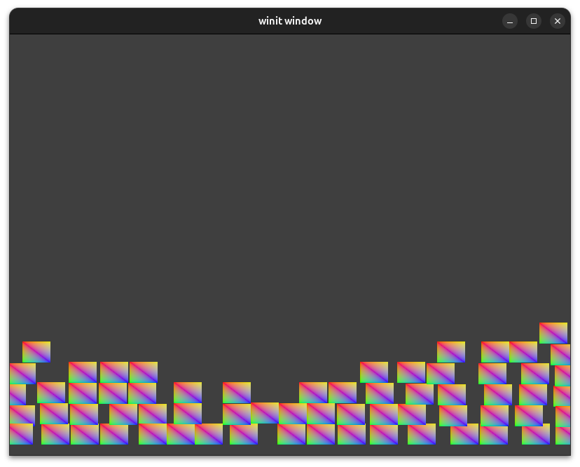

# rust-wgpu-2d-physics
This project is a high-performance **2D Physics Sandbox** built with **Rust** and **WebGPU (wgpu)**. It demonstrates real-time hardware-accelerated rendering using instancing and a custom physics engine.

---

## 🚀 Key Features

* **GPU Instancing:** Efficiently renders up to 1,000 entities in a single draw call by passing instance data to the vertex shader.
* **Real-time Physics:** * **AABB Collision:** Rigid-body collision detection and resolution between entities.
    * **Kinematics:** Includes gravity, air resistance (friction), and kinetic energy loss upon impact.
    * **Boundary Constraints:** Entities react to walls and floor with configurable bounce (restitution) and friction.
* **Interactive Input:**
    * **Spawn:** Click on empty space to spawn a new entity with random initial velocity.
    * **Drag & Drop:** Click and hold an existing entity to grab and move it. Releasing the mouse transfers momentum to the object.
* **Cross-Platform Windowing:** Powered by `winit` for seamless window management and event handling.

---

## 🛠 Tech Stack

* **Language:** [Rust](https://www.rust-lang.org/)
* **Graphics API:** [wgpu](https://wgpu.rs/) (WebGPU implementation for Native/Web)
* **Shading Language:** WGSL (WebGPU Shading Language)
* **Windowing:** `winit`
* **Math/Data:** `bytemuck` (for memory layout) and `pollster` (for async execution)

---

## 📂 Architecture Overview

### 1. Rendering Pipeline
The application uses a custom-built render pipeline defined in `state.rs`. It utilizes two vertex buffers:
1.  **Vertex Buffer:** Defines the local geometry of a single square (two triangles).
2.  **Instance Buffer:** Stores the unique positions of all active entities, updated every frame on the GPU via `queue.write_buffer`.

### 2. Shading (`shader.wgsl`)
The vertex shader calculates the final clip-space position by adding the instance position to the model vertex coordinates:
$$out.clip\_position = vec4<f32>(model.position.xy + model.instance\_pos, model.position.z, 1.0)$$

### 3. Physics Engine
The `update()` loop in `state.rs` handles:
* **Entity-to-Entity Collision:** Uses Axis-Aligned Bounding Box (AABB) checks. When objects overlap, they are pushed apart based on the overlap depth, and their velocities are exchanged and dampened.
* **Integration:** Updates velocity based on gravity and applies it to the position.

---

## 🕹 How to Run

1.  **Prerequisites:** Ensure you have the [Rust toolchain](https://rustup.rs/) installed.
2.  **Clone the repository:**
    ```bash
    git clone <repository-url>
    cd <project-folder>
    ```
3.  **Run the application:**
    ```bash
    cargo run --release
    ```

### Controls
* **Left Click (Empty Space):** Spawn a new square.
* **Left Click & Drag (On Object):** Pick up and throw a square.
* **Resize Window:** The viewport and surface configuration update automatically.

---

## ⚙️ Configuration
You can adjust the physics constants in `state.rs` within the `update()` method:
* `gravity`: Adjusts the downward pull.
* `half_size`: Changes the dimensions of the entities.
* `wall_bounce` / `floor_bounce`: Controls how much energy is kept after hitting a boundary.

